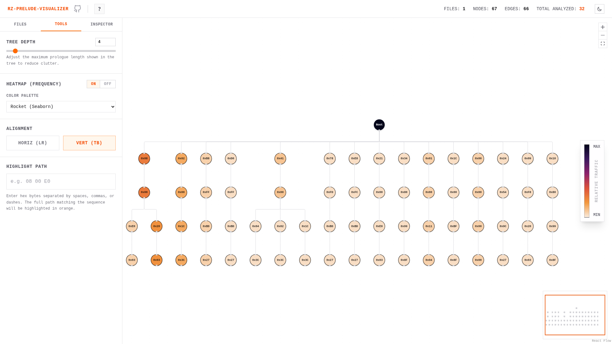
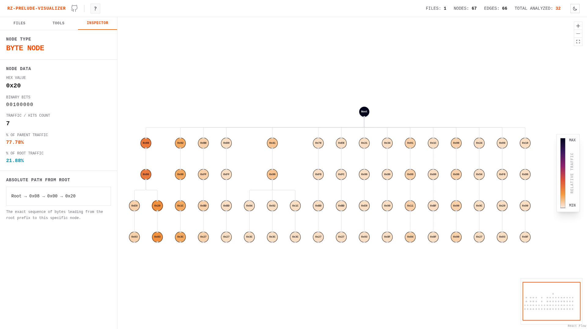
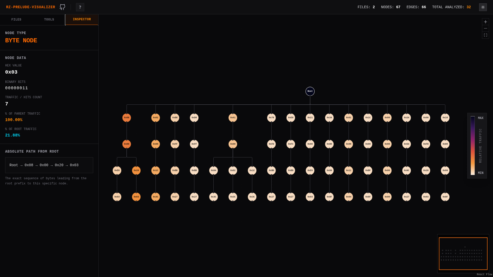

# rz-prelude-visualizer

Interactive visualizer for function prologue trees generated by the `prologues_generator` plugin from [Rizin](https://github.com/rizinorg/rizin) (`pg` cmd).

Helps reverse engineers and data scientists visually analyze prologue signature trees by visualizing branching traffic, highlighting specific bytes, and exploring the prologue tree dataset.



## How to use and Features

- open a file in rizin session.
- run `pg` to generate prologue prefix tree.
- print and export the tree in json using `pgpj` using redirection

```bash
pg
pgpj > gen.json
``` 

Upload the file to this website to visualize the tree.

Website Link: https://rz-prelude-visualize.vercel.app/

### Interactive Graph Visualization
- Drag and drop JSON file from the `prologues_generator` plugin to instantly visualize the prologues tree.
- **Dynamic Tree Layout:** Switch between Horizontal (Left-to-Right) and Vertical (Top-to-Bottom) alignments.
- **Tree Depth Control:** Restrict the maximum rendering depth for massive prologue datasets to improve performance and focus on critical branching early in the sequences. Also it helps to reduce the clutter.
- **Multiple files Support:** Load multiple JSON files simultaneously and toggle between them without losing context.

### Traffic Analysis (Heatmap)
- **I love heatmaps :)** -  Nodes are colored based on their relative traffic (hit count relative to the root node). Helps identify which are common and which are rare.
- **Standard Color Palettes:** Toggle between "iconic data science palettes" XD (`Rocket`, `Mako`, `Viridis`).
- Color scale on right...

### Search & Highlighting
- **Highlight Path:** Search for specific hex byte sequences (e.g. `08 00 E0`) to highlight the complete matching traversal path through the tree in bright orange. (Though i would suggest to turn off heatmap for this)

### Node Inspector
- Hover over any node to quickly look at hex, binary and hitcnt in a tool tip.
- Click on **Inspector** tab in sidebar to inspect the node.
    - **Detailed Byte Info:** Click on any node to view detailed hexadecimal and binary representations of the byte. 
    - **Relative Traffic Stats:** Inspect exact hit counts, and see what percentage of traffic this byte receives relative to both the entire dataset (root node) and its immediate parent node (branching signal).



### UX
- **Dark/Light Mode:** Yeah... even though unnecessary :P and its nice :)
- **Auto-Contrasting Nodes:** Node text dynamically changes to dark or light based on the luminance of the underlying heatmap background color.




## For Devs

- Node.js 20+
- pnpm

```bash
pnpm install
pnpm dev
```

## License
[GNU GPL-3.0](LICENSE)